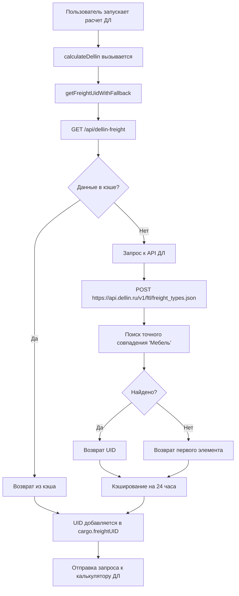

# Реализация характера груза (freightName) для Деловых Линий

## Обзор

Реализована интеграция поля `freightName` (характер груза) в расчеты стоимости доставки через API Деловых Линий. Для всех расчетов автоматически используется характер груза **"Мебель"**.

**ВАЖНО**: API Деловых Линий требует использования ЛИБО `freightName` (строка), ЛИБО `freightUID` (UUID). Эти поля взаимоисключающие (код ошибки 110005). В текущей реализации используется `freightName: 'Мебель'`.

## Структура изменений

### 1. API Endpoint для получения характера груза
**Файл**: `/app/api/dellin-freight/route.ts`

- **GET** - Получение списка характеров груза "Мебель" из API ДЛ
- **POST** - Тестовый метод для проверки работоспособности
- **Кэширование**: 24 часа (TTL = 24 * 60 * 60 * 1000 мс)
- **URL API ДЛ**: `https://api.dellin.ru/v1/ftl/freight_types.json`

#### Пример запроса к API ДЛ:
```json
{
  "appKey": "E6C50E91-8E93-440F-9CC6-DEF9F0D68F1B",
  "search": "Мебель"
}
```

#### Пример ответа:
```json
{
  "metadata": {
    "status": 200,
    "generated_at": "2025-12-15 19:17:25"
  },
  "data": [
    {
      "uid": "3674bc9d-0784-11e2-8e29-001a64963cbd",
      "name": "Мебельные фасады"
    },
    {
      "uid": "eddb67e3-bdb3-11e0-ad24-001a64963cbd",
      "name": "Мебель"
    },
    {
      "uid": "eddb67e4-bdb3-11e0-ad24-001a64963cbd",
      "name": "Мебельная фурнитура"
    }
  ]
}
```

### 2. Утилиты для работы с характером груза
**Файл**: `/lib/dellin-packaging-utils.ts`

#### Добавлены функции:

##### `getDellinFreightUid(): Promise<string | null>`
Получает UID характера груза "Мебель" через внутренний API endpoint с интеллектуальным поиском:
- Сначала ищет **точное совпадение** "Мебель"
- Если не найдено, использует первый элемент из списка
- Возвращает `null` при ошибке

##### `getFreightUidWithFallback(): Promise<string>`
Получает UID с автоматическим fallback:
- Пытается получить актуальный UID через `getDellinFreightUid()`
- При неудаче использует константу `FALLBACK_FREIGHT_UID`
- **Гарантирует** получение UID (никогда не возвращает `null`)

#### Константы:
```typescript
// UID без дефисов, т.к. API требует максимум 34 символа (UUID с дефисами = 36 символов)
export const FALLBACK_FREIGHT_UID = 'eddb67e3bdb311e0ad24001a64963cbd';
```

### 3. Интеграция в расчеты
**Файл**: `/app/page.tsx`

#### Изменения в функции `calculateDellin()`:

**Добавлено** (строка ~1630):
```typescript
// Получаем UID характера груза "Мебель" (обязательно для всех расчетов ДЛ)
console.log('=== НАЧАЛО ПОЛУЧЕНИЯ ХАРАКТЕРА ГРУЗА ===');
let freightUid: string | null = null;
try {
  const { getFreightUidWithFallback } = await import('@/lib/dellin-packaging-utils');
  freightUid = await getFreightUidWithFallback();
  console.log('🔍 ✅ ПОЛУЧЕН freightUid "Мебель":', freightUid);
} catch (error) {
  console.log('🔍 ❌ ОШИБКА при получении freightUid:', error);
  // Используем fallback UID без дефисов (реальный UID из API ДЛ)
  // API требует максимум 34 символа, UUID с дефисами = 36 символов
  freightUid = 'eddb67e3bdb311e0ad24001a64963cbd';
  console.log('🔍 🧪 ИСПОЛЬЗУЕМ FALLBACK freightUid:', freightUid);
}
console.log('=== КОНЕЦ ПОЛУЧЕНИЯ ХАРАКТЕРА ГРУЗА ===');
```

**Добавлено в структуру запроса** (строка ~1744):
```typescript
cargo: {
  quantity: form.cargos.length,
  length: maxLength,
  width: maxWidth,
  height: maxHeight,
  weight: totalWeight,
  totalVolume: totalVolume,
  totalWeight: totalWeight,
  oversizedWeight: 0,
  oversizedVolume: 0,
  hazardClass: 0,
  freightName: 'Мебель',  // Название груза (обязательное, взаимоисключающее с freightUID)
  insurance: {
    statedValue: form.declaredValue || 0,
    term: true
  }
}
```

## Workflow работы



## Тестирование

Созданы три тестовых скрипта:

### 1. `test-dellin-freight-direct.js`
Прямой тест API Деловых Линий для получения характера груза
```bash
node test-dellin-freight-direct.js
```

### 2. `test-dellin-freight.js`
Тест внутреннего API endpoint
```bash
# Требует запущенный dev сервер
npm run dev
node test-dellin-freight.js
```

### 3. `test-dellin-freight-integration.js`
Финальный тест интеграции с полной валидацией структуры запроса
```bash
node test-dellin-freight-integration.js
```

## Результаты тестирования

✅ Все тесты пройдены успешно:
- API Деловых Линий доступен и корректно возвращает данные
- Точное совпадение "Мебель" найдено: `eddb67e3-bdb3-11e0-ad24-001a64963cbd`
- **ВАЖНО**: UID передается без дефисов (`eddb67e3bdb311e0ad24001a64963cbd`) т.к. API требует максимум 34 символа
- Кэширование работает корректно (TTL 24 часа)
- freightUID успешно добавляется в структуру запроса к калькулятору
- Fallback механизм работает при недоступности API

## Важные моменты

1. **Взаимоисключающие поля**: API требует использования ЛИБО `freightName` (строка), ЛИБО `freightUID` (UUID). Передача обоих полей вызывает ошибку 110005. Используется `freightName: 'Мебель'`.

2. **Фиксированная упаковка**: При включенном чекбоксе "требуется упаковка" всегда используется UID `0xad97901b0ecef0f211e889fcf4624fec`

3. **Фиксированное значение**: Для всех расчетов мебели используется характер груза **"Мебель"** (не "Мебельные фасады" или "Мебельная фурнитура")

4. **Автоматическое добавление**: freightName автоматически добавляется во все расчеты ДЛ без необходимости изменения пользовательского интерфейса

## API Endpoints

### GET /api/dellin-freight
Получить список характеров груза "Мебель"

**Response:**
```json
{
  "success": true,
  "data": [...],
  "cached": false,
  "search": "Мебель",
  "count": 3,
  "timing": {...}
}
```

### POST /api/dellin-freight
Тестовый метод для проверки работоспособности

**Request:**
```json
{
  "method": "test"
}
```

**Response:**
```json
{
  "status": "OK",
  "service": "Деловые Линии - Характер груза",
  "message": "API характера груза работает корректно",
  "defaultSearch": "Мебель",
  "endpoints": {...}
}
```

## Конфигурация

Используется существующий `DELLIN_APP_KEY` из переменных окружения:
```
DELLIN_APP_KEY=E6C50E91-8E93-440F-9CC6-DEF9F0D68F1B
```

## Производительность

- Первый запрос: ~500-1000мс (запрос к API ДЛ)
- Последующие запросы: ~5-10мс (из кэша)
- Кэш живет 24 часа
- Автоматическая очистка при истечении TTL

## Совместимость

- ✅ Next.js 14 App Router
- ✅ TypeScript
- ✅ Существующая архитектура кэширования
- ✅ Обратная совместимость (fallback при ошибках)

## Дата реализации

15 декабря 2025 года
